This demo will walk you through setting up your network of a relay chain, Acurast parachain, and Statemint common-good parachain

## Node Deployments
Download the following repositories:
- [Polkadot](https://github.com/paritytech/polkadot): branch "release-v0.9.26"
- [Cumulus](https://github.com/paritytech/cumulus): branch "polkadot-v0.9.26"
- [Acurast](https://github.com/Acurast/acurast-substrate): branch "feat/job-payment"

### Polkadot
Compile to a binary
```shell
cargo build --release
```
<br>
Create raw chain spec

```shell
./target/release/polkadot build-spec --disable-default-bootnode --raw --chain=rococo-local > rococo-spec-raw.json
```
<br>
Deploy Alice and Bob validator nodes

```shell
./target/release/polkadot \
--alice \
--validator \
--base-path /tmp/relay/alice \
--chain rococo-spec-raw.json \
--port 30333 \
--ws-port 9944
```

```shell
./target/release/polkadot \
--bob \
--validator \
--base-path /tmp/relay-bob \
--chain rococo-spec-raw.json \
--port 30334 \
--ws-port 9945
```
<br>

### Acurast
Compile to a binary
```shell
cargo build --release
```
<br>
Create plain chain spec for editing

```shell
./target/release/parachain-collator build-spec --disable-default-bootnode > acurast-spec-plain.json
```
<br>
Check that the top part looks like this:

```json
{
  "name": "Acurast Testnet",
  "id": "acurast_testnet",
  "chainType": "Local",
  "bootNodes": [],
  "telemetryEndpoints": null,
  "protocolId": "acurast_local",
  "properties": {
    "ss58Format": 42,
    "tokenDecimals": 12,
    "tokenSymbol": "ACRST"
  },
  "relay_chain": "rococo_local_testnet",
  "para_id": 2000,
  ...
```
<br>
Now compile the plain spec into raw format

```
./target/release/parachain-collator build-spec --disable-default-bootnode --raw --chain=acurast-spec-plain.json > acurast-spec-raw.json
```
<br>

Create Genesis State and Validation code for parachain registration:
```shell
./target/release/parachain-collator export-genesis-state --chain acurast-spec-raw.json acurast-state
```
```shell
./target/release/parachain-collator export-genesis-wasm --chain acurast-spec-raw.json acurast-wasm
```
<br>

Launch Alice collator node. Ensure the correct path to the polkadot chain spec
```shell
./target/release/parachain-collator \
--alice \
--collator \
--force-authoring \
--chain acurast-spec-raw.json \
--base-path /tmp/acurast/alice \
--port 40333 \
--ws-port 8844 \
-- \
--execution wasm \
--chain ../polkadot/rococo-spec-raw.json \
--port 30343 \
--ws-port 9977
```
<br>

### Statemint
Compile to a binary
```shell
cargo build --release
```
<br>
Create plain chain spec for editing

```shell
./target/release/polkadot-parachain build-spec --disable-default-bootnode --chain=statemint-local > statemint-spec-plain.json
```
<br>
Check that the top part looks like this:

```json
{
  "name": "Statemint Local",
  "id": "statemint_local",
  "chainType": "Local",
  "bootNodes": [],
  "telemetryEndpoints": null,
  "protocolId": null,
  "properties": {
    "ss58Format": 0,
    "tokenDecimals": 10,
    "tokenSymbol": "DOT"
  },
  "relay_chain": "rococo_local_testnet",
  "para_id": 1000,
  ...
```
<br>
Now compile the plain spec into raw format

```
./target/release/polkadot-parachain build-spec --disable-default-bootnode --raw --chain=statemint-spec-plain.json > statemint-spec-raw.json
```
<br>

Create Genesis State and Validation code for parachain registration:
```shell
./target/release/polkadot-parachain export-genesis-state --chain statemint-spec-raw.json statemint-state
```
```shell
./target/release/polkadot-parachain export-genesis-wasm --chain statemint-spec-raw.json statemint-wasm
```
<br>

Launch Alice collator node. Ensure the correct path to the polkadot chain spec
```shell
./target/release/polkadot-parachain \
--alice \
--collator \
--force-authoring \
--chain statemint-spec-raw.json \
--base-path /tmp/statemint/alice \
--port 50333 \
--ws-port 7744 \
-- \
--execution wasm \
--chain ../polkadot/rococo-spec-raw.json \
--port 30343 \
--ws-port 9977
```
<br>

## Connecting the parachains
Open 3 polkadot.js browser windows, one for each node:
- [relay](https://polkadot.js.org/apps/?rpc=ws%3A%2F%2F127.0.0.1%3A9944#/explorer)
- [acurast](https://polkadot.js.org/apps/?rpc=ws%3A%2F%2F127.0.0.1%3A8844#/explorer)
- [cumulus](https://polkadot.js.org/apps/?rpc=ws%3A%2F%2F127.0.0.1%3A7744#/explorer)


On the relay chain we first reserve the para id 2000 for acurast. 1000 for statemint is already reserved:
- go to parachains menu


- in parathreads submenu, click on ParaId button


- paraId number is hardcoded, and counts by one each time you execute it from 2000.

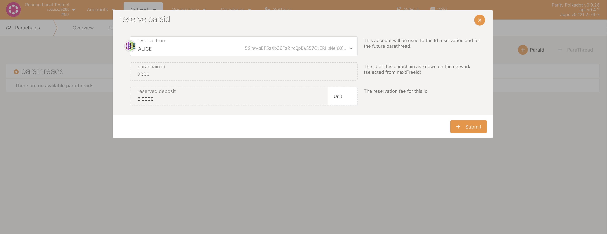

- sign the transaction with whichever account. Alice works fine


We now have to register the parachains
to each id:

- go to sudo menu

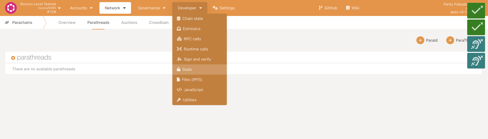

- select the paraSudoWrapper pallet, and sudoScheduleParaInitialize call. fill in 2000 for acurast, parachain-Yes, and for genesis head and validation code upload the ones in the acurast folder

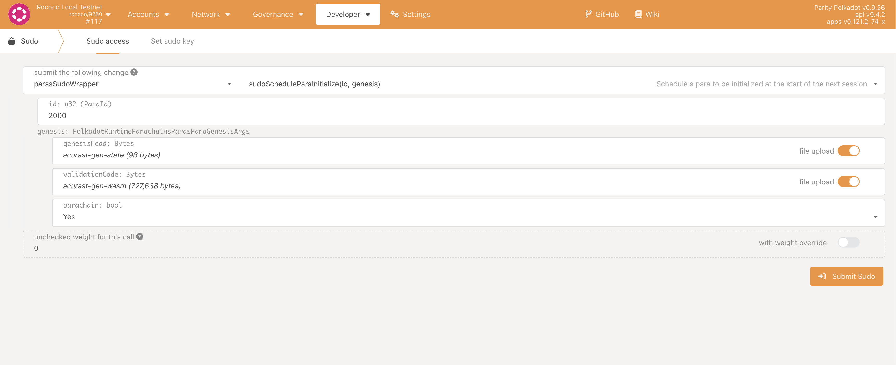

- same deal with statemint, but we use paraid 1000 and different genesis state and wasm code

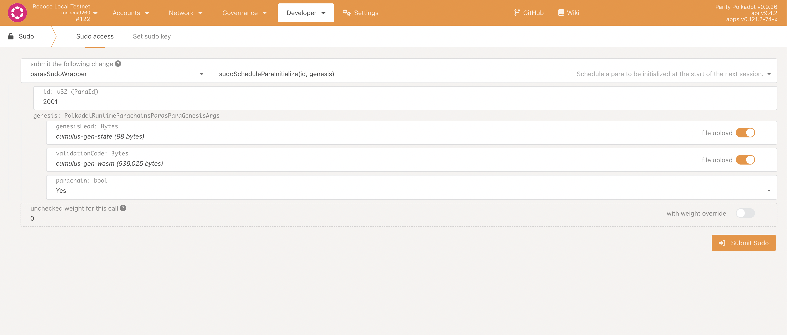


Wait for the parachains to be onboarded:
- you can check the onboarding status on the parachains menu from before

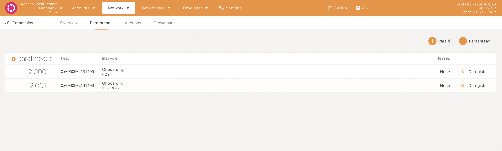

- once they are onboarded, they should appear in black letters on overview

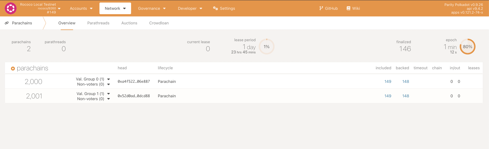

Establish communication channel between the chains:
- go to sudo menu and paraSudoWrapper pallet again, but this time select the sudoEstablishHrmpChannel call. Fill the following for one way communication from 2000 to 1000. Repeat the process for 1000 to 2000 communication with swapped sender and recipient

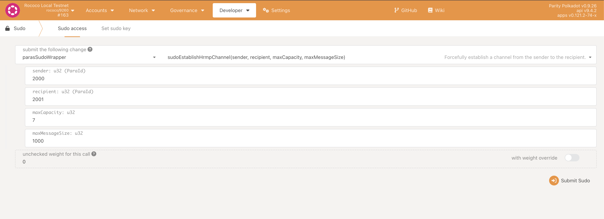
<br>

## Transfering Statemint Assets to Acurast
Transfers between untrusted parachains need to be in the form of reserve-backed transfers. This means the sender tells the reserve parachain to move assets from its account to a parachain's account, and then tell the parachain to mint those assets locally and give them to the receiver. The reserve we are using is called Statemint

For the first step, the internal transfer in Statemint needs to go from Alice's account to Acurast's soverign account on statemint. If the soverign account holds less than the existential deposit (1 DOT) it won't be eligible to participate in the network.
<br>

### Send 100 DOT to Acurast Soverign Account on Statemint
Go to Accounts and next to an account like Alice, press "Send".
in the destination field fill in the following address:
```0x7369626cd0070000000000000000000000000000000000000000000000000000```

Sovereign accounts are defined by 2 prefixes, and the rest filled with zeroes:
#### First part
- Is it a child parachain? b"para" (up/down) = ```0x70617261```
- Is it a sibling parachain? b"sibl" (side-to-side) = ```0x7369626c```

#### Second part
- we use scale encoding on the parachain id. so in the case of id 2000, the resulting binary is ```0xd0070000```

#### Last part
- we fill in the rest of the binary string with zeroes until we get 64 characters, without counting the hex prefix "0x". This amount to a 64 byte address ```000000000000000000000000000000000000000000000000```

### Create Tokens on Statemint
For the moment acurast cannot receive DOT, so it treats statemint tokens of id 42 as if it were their native ACRST token. This means they can be used to pay for execution, and they will appear in the Balances, and not the Assets pallet.

#### Create 
Go to Developer > Extrinsics. Select the Assets pallet and the create() extrinsic.
```
id: 42
admin: ALICE,
minBalance: 100 (specific number not relevant for this demo)
```
Do the same with another id like <b>22</b>. This other token will be the one used to pay for a job in the acurast pallet.

#### Mint
Now that the assets are created, we need to mint an amount of them.
Same place as where you created them, but now choose the mint() extrinsic.

```
id: 42
beneficiary: ALICE
amount: 100000000000000
```

This will mint 100 tokens of token 42 to ALICE. note that any token needs to be followed by 12 zeroes to get the basic unit of transaction.

Now do the same for token 22 (or whatever id you chose).
<br>

### Reserve Backed Transfer to Acurast
Now it's time to send these 2 tokens to acurast:<br>
Go to Developer > Extrinsics > Decode<br>
paste the following encoded call:
```shell
0x1f0201010100411f0100010100306438cbe153140e613d93e1611f12e604db9876e0bf4f1a3bd95176c2c77a37010800000204320558000b00a0724e1809000002043205a8000b00602225aa3f01000000
```

Go back to Submission and you should see something like this:

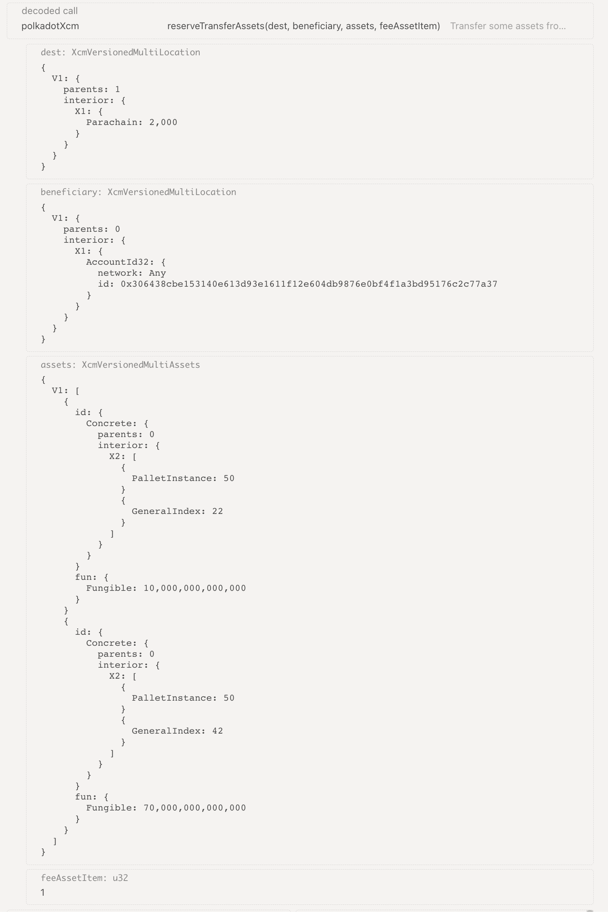

You are sending 10 ACRST on statemint (id 42) for execution, and 70 tokens (id 22) for paying your job in acurast.

The beneficiary has an id of a new account created with the UI in Accounts > Add account. It's better to give it to an account with low funds because other accounts have millions of native tokens, and it won't display its new balance with token 42 (native). The recipient must have at least the "existential deposit amount" in its account prior to any transfer.

You can now go to Submission and click on ```Submit Transaction```
<br>

### Creating Pallet Account
To hold the assets between a job submission, and a job fulfillment, Acuras needs to hold it in a special pallet account. It's composed of the binary string b"modl" + b"acrstpid", and appended with zeroes until 64 bytes.

"modl" is the identifier for pallet accounts, and "acrstpid" is the one for the acurast pallet

- Go to Acurast Parachain UI > Accounts.
- Next to an account with funds like Alice, click ```Send```
- On the recipient field, add:

```
0x6d6f646c61637273747069640000000000000000000000000000000000000000
```
- Send 10 ACRST

### Posting a job
With the assets now on minted on Acurast, it's time to post a job.

Go to Developer > Extrinsics and paste the following encoded call:
```
0x2800d4697066733a2f2f00000000000000000000000000000000000000000000000000000000000000000000000000000000000000000000000000010300a10f04320558000b008028a54607
```
The call should look like this:

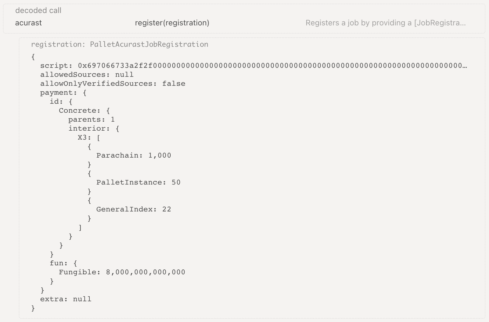

Ensure that the caller account is the one you sent the tokens to, and
submit the transaction.

Now look at Network > Explorer and wait for the job posted event.
<br>

### Manually Assign a Processor
In the future, the marketplace engine will match a processor with a job, but for now we need to manually specify which account can process our job.

In the current configuration, the job creator is the one allowed to specify this

Go to Developer > Extrinsics > Decode and paste the encoded call:
```
0x280304008eaf04151687736326c9fea17e25fc5287613693c912909cb226aa4794f26a481c2e5dcac5d0191960bfa6be33e5cb96f684673075b8d2d04ce93849b4f38e3ed4697066733a2f2f00000000000000000000000000000000000000000000000000000000000000000000000000000000000000000000
```

It should look like this:

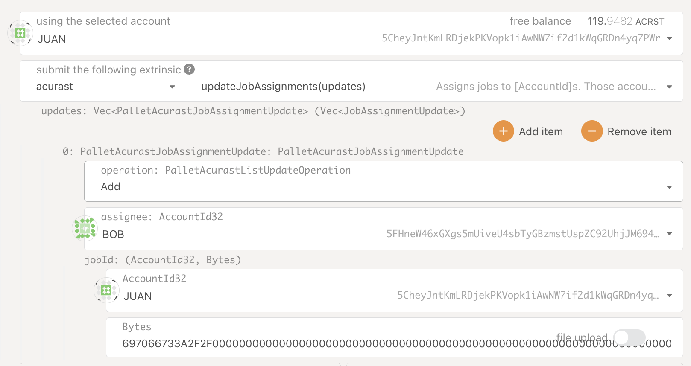

The Job creator is the account executing the extrinsic, and it's giving BOB the right to process it.
<br>

### Fulfill a Job
Now for the final step, we are going to process a job and submit a fulfill extrinsic.

Go to Developer > Extrinsics and paste the encoded call:
```
0x2804d4697066733a2f2f00000000000000000000000000000000000000000000000000000000000000000000000000000000000000000000141234567890001c2e5dcac5d0191960bfa6be33e5cb96f684673075b8d2d04ce93849b4f38e3e
```

It should look like this:

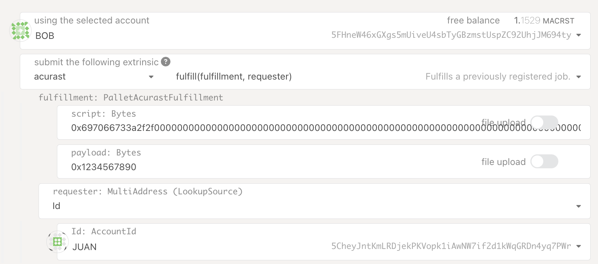

For now there is no check that the fulfillment payload is correct, so we can out whatever.

Submit the transaction, and go to the Explorer to see the Success Events:

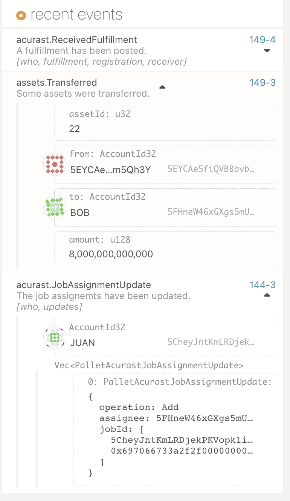